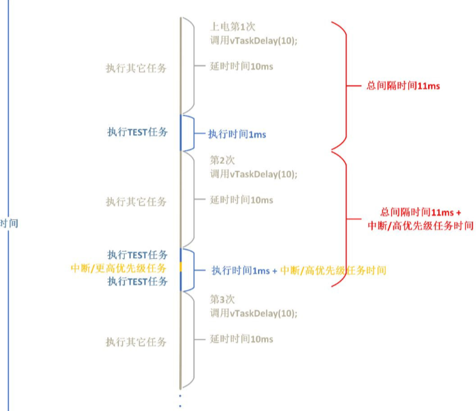

# FreeRTOS时间管理

## 一、延时函数介绍

### 1、FreeRTOS的延时函数

答：FreeRTOS有两种延时函数：相对延时函数 和 绝对延时函数。

- 相对延时：指每次延时都是从执行函数vTaskDelay()开始，直到延时指定的时间结束。
- 绝对延时：指将整个任务的运行周期看成一个整体，适用于需要按照一定频率运行的任务。

注意：一般来说，绝对延时中的主体任务运行所需时间必须比绝对延时时间小。

### 2、相对延时和绝对延时的区别

答：

相对延时：

绝对延时：

------

## 二、延时函数解析

### 1、相对延时函数内部解析

答：

1. 判断延时时间是否大于0，大于0才有效。
2. 挂起调度器。
3. 将当前正在运行的任务从就绪列表移除，添加到阻塞列表prvAddCurrentTaskToDelayedList( )。
    1. 将该任务从就绪列表中移除。
    2. 如果使能挂起操作，并且延时时间为0XFFFF FFFF，并且xCanBlockIndefinitely等于pdTRUE，就代表此时是一直等，相当于挂起，所以添加到挂起列表。
    3. 如果延时时间小于0XFFFF FFF。
        - 记录阻塞超时时间，并记录在列表项值里（通过该值确定插入阻塞列表的位置）。
        - 如果阻塞超时时间溢出，将该任务状态列表项添加到溢出阻塞列表。
        - 如果没溢出，则将该任务状态列表项添加到阻塞列表，并判断阻塞超时时间是否小于下一个阻塞超时时间，是的话就更新当前这个时间为下一个阻塞超时时间  
4. 恢复任务调度器。
5. 进行一次任务切换。

### 2、延时函数的流程

答：

- 正在运行的任务。
- 调用延时函数。
- 此时将该任务移除就绪列表，并添加到阻塞列表中。
- 滴答中断里边进行计时。
- 判断阻塞时间是否到达，如果到达将从阻塞列表移除，添加到就绪列表。

------

