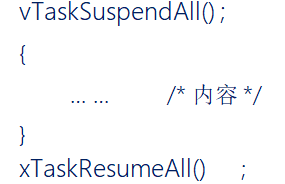

# 任务调度器的挂起和恢复

### 1、任务调度器挂起和恢复函数

答：

使用格式示范：

### 2、任务调度器挂起和恢复的特点

答：

1. 与临界区不一样的是，挂起任务调度器，未关闭中断。
2. 它仅仅是防止任务之间的资源争夺，中断照样可以直接响应。
3. 挂起任务调度器的方式，适用于临界区位于任务与任务之间；既不用去延时中断响应，又可以做到临界区的安全。

### 3、挂起任务调度器：vTaskSuspendAll()  

答：调用一次挂起调度器，该变量uxSchedulerSuspended就加一 ，变量uxSchedulerSuspended的值，将会影响Systick触发PendSV中断，即影响任务调度。

### 4、恢复任务调度器：xTaskResumeAll()  

答：调用一次恢复调度器，该变量uxSchedulerSuspended就减一 ，如果uxSchedulerSuspended等于0，则允许调度 。

1. 当任务数量大于0时，恢复调度器才有意义，如果没有一个已创建的任务就无意义。
2. 移除等待就绪列表中的列表项,恢复至就绪列表,直到xPendingReadyList列表为空。
3. 如果恢复的任务优先级比当前正在执行任务优先级更高，则将xYieldPending赋值为pdTRUE,表示需要进行一次任务切换。
4. 在调度器被挂起的期间内,是否有丢失未处理的滴答数。 xPendedCounts是丢失的滴答数，有则调用xTasklncrementTickf() 补齐弄失的滴答数。
5. 判断是否允许任务切换。
6. 返回任务是否已经切换；已经切换返回pdTRUE；反之返回pdFALSE。